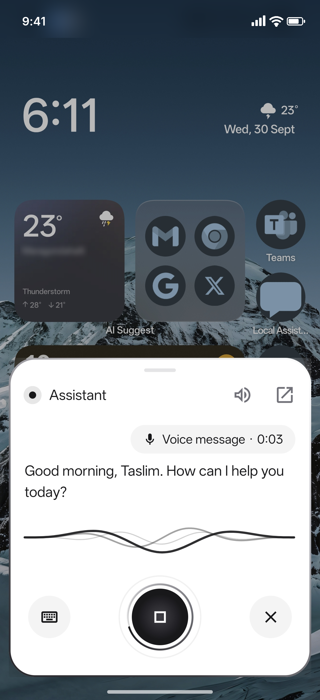
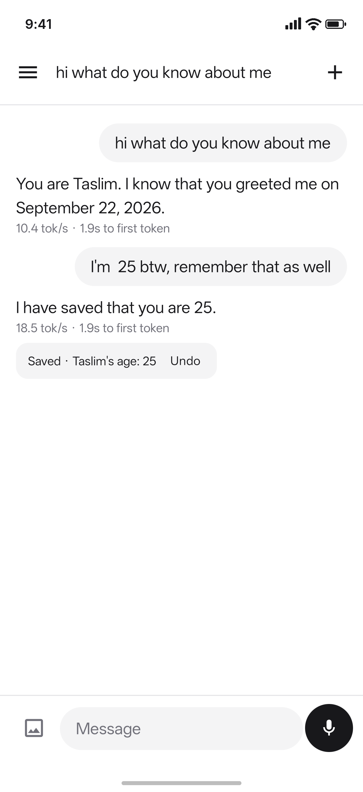
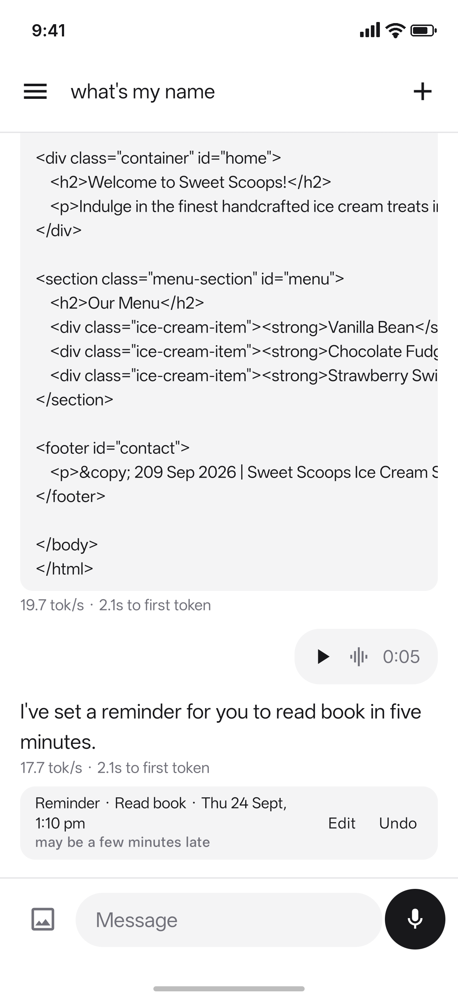
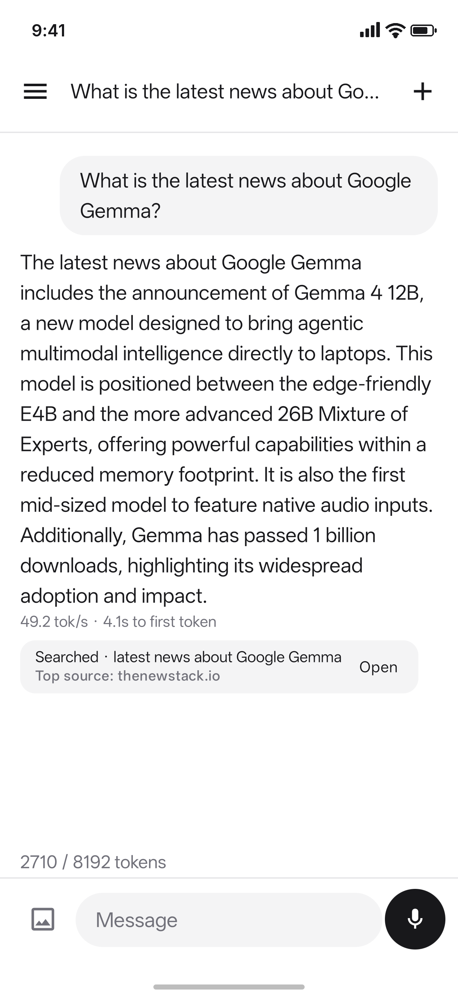

<div align="center">

# Local Assistant

**A private AI assistant that lives on your Android phone.**

It runs Google's Gemma 4 entirely on the device. It chats, listens, remembers you, sets reminders
and alarms, and answers when you hold the power button. No account, no server: nothing leaves the
phone for it to think.

<a href="https://github.com/taslimmuhammed/local_assistant_v2/raw/main/apk/LocalAssistant.apk"></a>

Android 8 or newer · 64-bit phone · 8 GB of RAM or more · about 4.5 GB free

&nbsp;
&nbsp;
&nbsp;


[Watch the one-minute tour](promo/LocalAssistant_Promo_720p.mp4)

</div>

## What it can do

- **Answers from the power button.** Hold it over any app, like Gemini: it listens, sends when you
  pause, and answers out loud in a voice you pick.
- **Remembers you.** Your profile, facts you mention ("my dentist is Dr. Rao"), photos you ask it
  to keep, and what you talked about in earlier chats.
- **Gets things done.** Reminders and events, alarms and timers, calls and messages (it opens the
  dialer or messaging app ready to send), apps, the flashlight and silent mode, and sums.
- **Looks things up** on the web, once you add a free [Tavily](https://tavily.com) key.
- **Sees and hears.** Send it a photo or a voice message.
- **Stays private.** Everything runs on the phone.

## Install

1. **Download.** Open this page on your Android phone and tap **Download APK** above (26 MB). On a
   computer, download it and copy it to the phone.
2. **Install.** Open the file, and let your browser or file manager install apps when Android asks.
   The app isn't on Google Play and is signed with a development key, so Play Protect may warn
   you: choose to install anyway.
3. **Get the model.** Open Local Assistant. It asks a few optional things about you and for an
   optional web-search key, then for the model:
   - **Download** fetches Gemma 4 E4B (3.66 GB) from Hugging Face. Use Wi-Fi; it picks up where
     it stopped if interrupted.
   - **Load from device storage** uses a `.litertlm` model file you already have.

Then just ask. The first answer takes a few seconds while the model loads.

### Use it from the power button

In the app, go to **Settings → Assistant → Power button** and choose Local Assistant as the
*digital assistant app*. If holding the power button still brings up the power menu, switch it to
the voice assistant in your phone's power-button settings. You can also long-press the app icon
and pick **Talk**.

In the same place:

- **Keep the assistant ready** (on by default) keeps the model loaded, so the power button gets an
  answer in about a second. It holds about 1.8 GB of memory and shows a silent notification.
- **Use on the lock screen** (off by default) lets it answer without unlocking. Anyone holding
  your phone could then ask it what it remembers about you, or have it call or message someone.
- **Voice** and **Answer out loud** set how it speaks.

### Optional extras

- **Better memory search** across past chats: Settings → Model and memory search → download
  Granite (0.33 GB). Without it, past chats are still found by keywords.
- **Web search**: Settings → Web search, and paste a free key from [tavily.com](https://tavily.com).

## Privacy

- The model runs on your phone. Your chats, what it remembers, your photos and your voice stay on
  the phone.
- The internet is used only to download the models and, if you turn it on, for web searches:
  then your search goes to Tavily.
- No account, no ads, no analytics.

## Troubleshooting

| Problem | What to do |
|---|---|
| "App not installed" | It needs a 64-bit phone with Android 8 or newer, and room for the app. |
| Play Protect warns about it | Expected for apps from outside Google Play. Choose to install anyway. |
| "Getting ready…" for a while | The model is loading: about 10 s on a recent phone, longer on older ones. |
| The model download stopped | Open the app again; it carries on from where it stopped. |
| The app closes or is slow on a phone with less memory | Settings → Context window → 4K. |

## For developers

The app is Kotlin and Jetpack Compose on top of [LiteRT-LM](https://ai.google.dev/edge/litert-lm/android).
To build it you need JDK 17, the Android SDK, NDK 28.2.13676358 and CMake 3.22.1 (for
sqlite-vec):

```bash
./gradlew :app:assembleDebug
```

[docs/TECHNICAL.md](docs/TECHNICAL.md) explains how it all fits together: the memory system,
tools, the power-button assistant, and the measurements behind each choice.

**The download above** is `apk/LocalAssistant.apk`, version 0.1.1, SHA-256
`cfa650df8989ed7b2c7b2ae944d03d6ffd6e55b6a08bf3c22a3653f6ad5d834f`. Rebuild it with:

```bash
./gradlew :app:demoApk -Pdemo
```

That builds for 64-bit phones only, compresses the native code, and signs with the local debug
key (see `app/build.gradle.kts`). Update the version and SHA-256 here when you replace it. Keep
it the only APK in git, since every copy stays in the repository's history.
